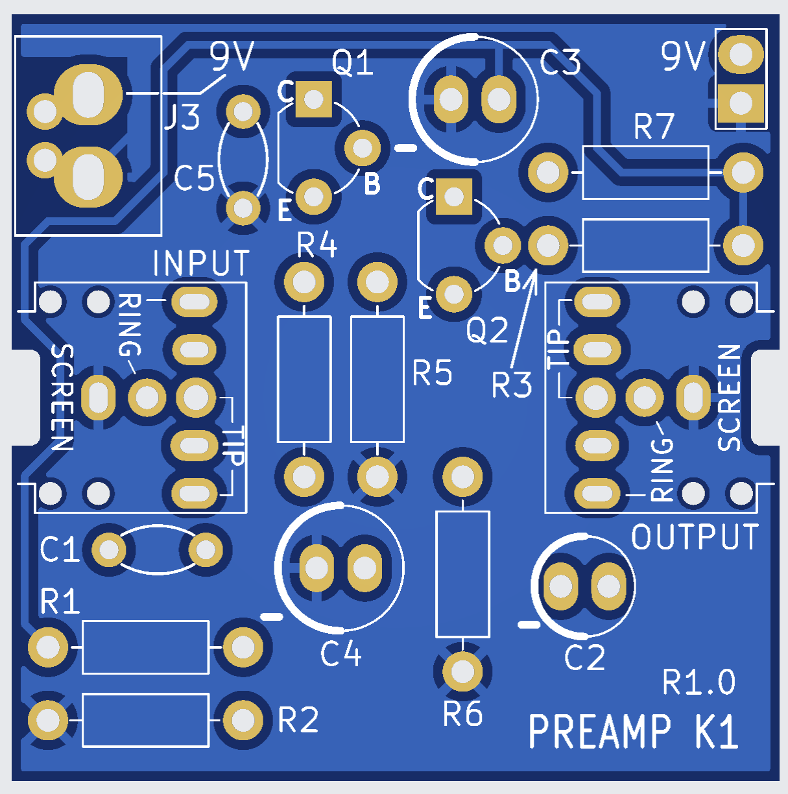
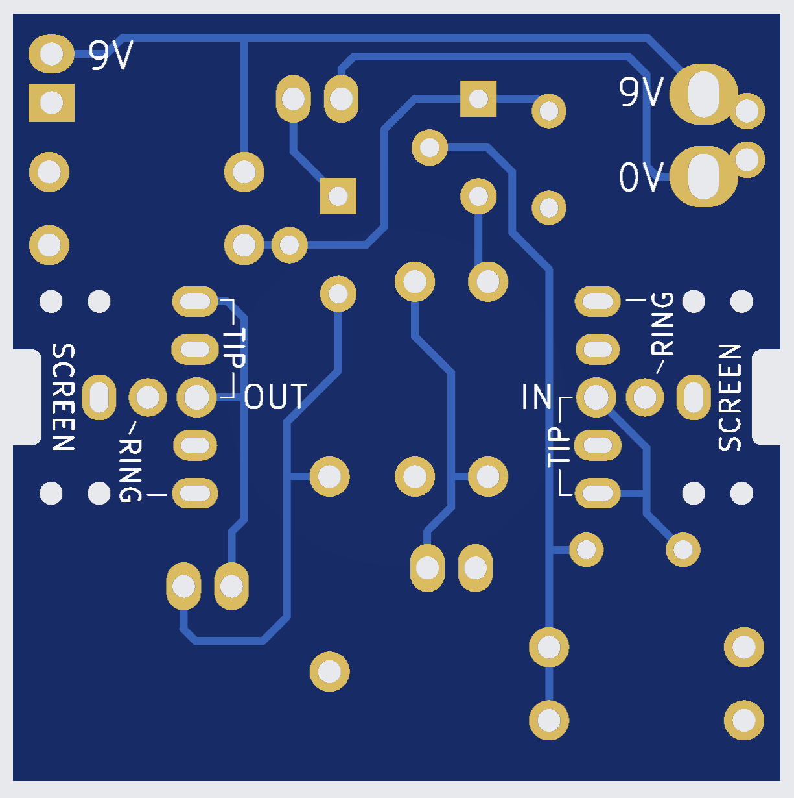
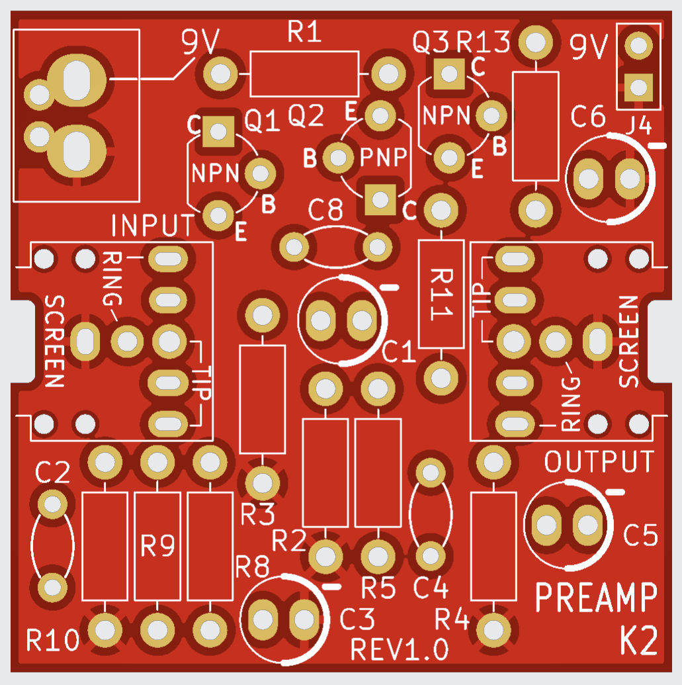
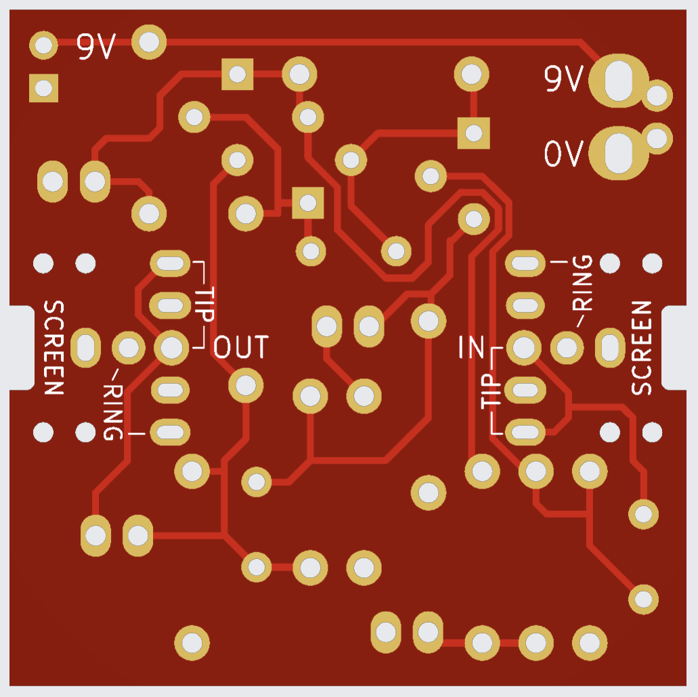

# Discrete Preamps

This repository contains two discrete audio preamplifier designs intended primarily for HF receiver applications (speech, not high-fidelity music).  

Each design includes:
- KiCad 10 schematic and PCB files  
- Gerber files for fabrication  
- PDF exports for easy viewing without KiCad  

---

## Preamp K1

Designed by M. Kellett, this preamplifier is optimised for speech signals in HF receivers.

- **Gain:** ~28 dB  
- **Bandwidth (-3 dB):** ~150 Hz to 10 kHz (approximate)  
- **Use case:** Moderate gain front-end with relatively wide speech bandwidth  

### Schematic

### PCB Top

### PCB Underside

---

## Preamp K2

Also designed by M. Kellett, this version provides higher gain and a slightly narrower bandwidth, making it suitable where additional amplification is required.

- **Gain:** ~45 dB  
- **Bandwidth (-3 dB):** ~100 Hz to 7 kHz (approximate)  
- **Use case:** Higher gain stage for weak signal amplification  

### Schematic

### PCB Top

### PCB Underside

---

## Notes

- These designs are intended for experimentation and adaptation.  
- Component values and performance figures are approximate and may vary depending on build and layout.  
- KiCad version compatibility: **KiCad 10** recommended.  
